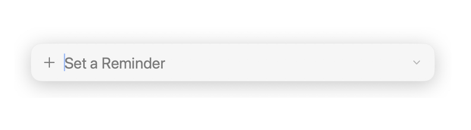

<p align="center">
  
</p>

<h1 align="center">Reminders Spotlight</h1>

<p align="center"><em>A Spotlight-style quick-entry app for Apple Reminders on macOS.</em></p>

Press a global shortcut (default **⌥Space**) to open a Spotlight-like bar onto the screen. Type reminders in plain language and hit Enter. Reminders Spotlight parses date, list, priority, and tags as you type and saves the complete entry to Apple Reminders.
Or, press the shortcut and nudge your mouse: the Spotlight bar will drop down into a list of active Reminders that you can edit, delete, or check off as you work, at a moment's notice.

<p align="center">
  
</p>

## Features

- **Spotlight-style entry**: A centered floating panel on ⌥Space, with a pop-in animation.
- **Natural language**: "Call mom tomorrow 9am !!" sets the due date, time, and priority automatically; tags are recognized too.
- **`@` list shortcuts**: Define your own in *Settings → Shortcuts* (e.g. `@p` → Personal). Typing the shortcut routes the reminder to that list and disappears from the text.
- **Move to browse, type to write**: Nudge the mouse and the panel expands to show all your reminders; start typing and it collapses back so you can focus on the new one.
- **Menu-bar dropdown** allows you to toggle which lists are shown, open settings, or quit the application.
- **Quick checkmark** confirmation when a reminder is saved.

## Building

This project is generated with [XcodeGen](https://github.com/yonaskolb/XcodeGen):

```sh
xcodegen generate
open RemindersSpotlight.xcodeproj
```

Or build, sign, and install to `/Applications` in one step:

```sh
./build_install.sh
```

(The script auto-detects your "Apple Development" signing identity; override with `RMB_SIGN_IDENTITY` if needed.)

## Credits & license

Reminders Spotlight is a fork of [**reminders-menubar**](https://github.com/DamascenoRafael/reminders-menubar) by Rafael Damasceno, reworked into a Spotlight-style quick-entry tool. Like the original, it is licensed under the **GNU General Public License v3** — see [LICENSE](LICENSE).
